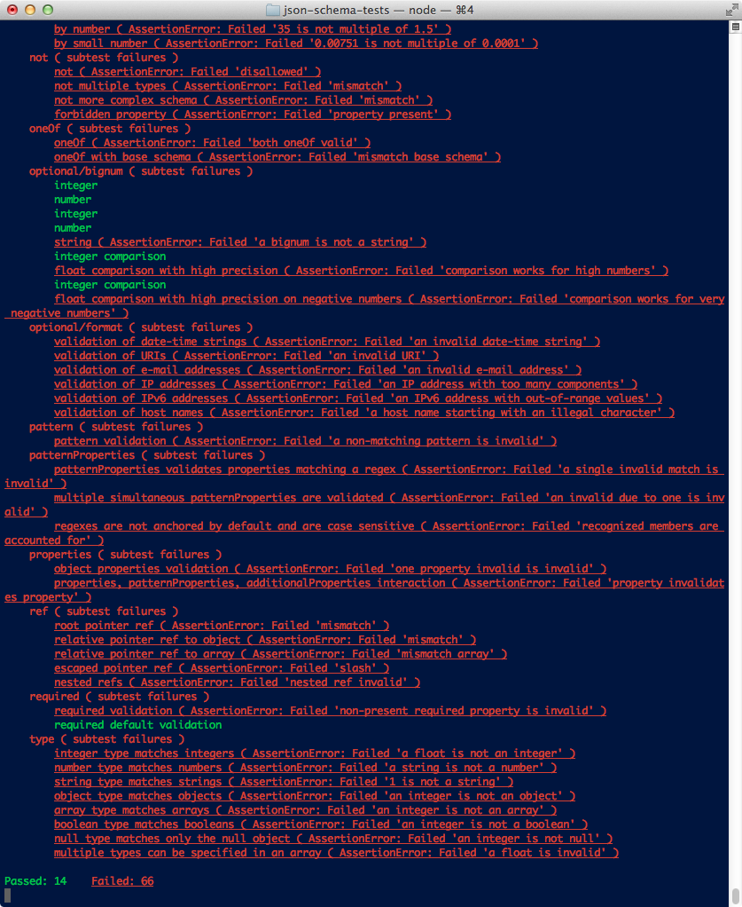

# json-schema-tests

A node.js tool for testing JSON Schema validators against the [JSON Schema Test Suite](https://github.com/json-schema/JSON-Schema-Test-Suite).

The npm package includes a copy of the JSON Schema Test Suite files from the time of publishing.  The present version is [1.1.2-28-gaabcb34](https://github.com/json-schema/JSON-Schema-Test-Suite/tree/aabcb3427745ade7a0b4d49ff016ad7eda8b898b).

If you install json-schema-tests globally, you can use it like this:

    json-schema-tests path/to/validator_adapter.coffee # or .js

The "validator adapter" must export three fields, `version`, `validator`,
and `ignores`.

* `version`: used to select the correct test suite.
  Must be either "draft3" or "draft4".
* `validator`: a function that takes a schema and a document, then validates
  the document against the schema.  Return the result like this: `{valid: true}`
* `ignores`: specify any JSON Schema attributes that you choose not to test.
  See [examples/jsck.coffee](examples/jsck.coffee) for the format.

To demonstrate a baseline, I've included a sycophantic validator in the examples.
It always says the document is valid.  The output for [examples/yes.coffee](examples/yes.coffee)
looks like this:

Full text of that output is [here](examples/yes-output.txt).

## Development

After cloning the repo, you'll need to acquire the test suite submodule:

    git submodule update --init

